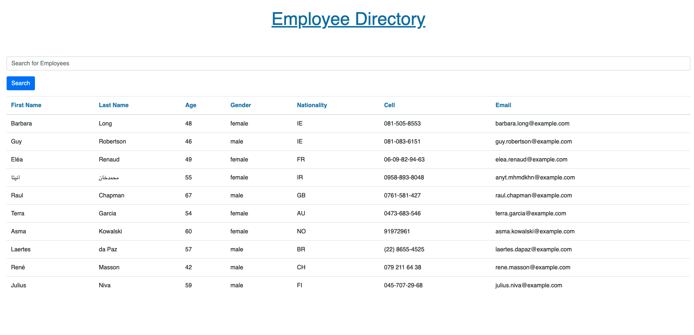

# Employee-Directory

The Employee Directory is a React App that gives the User quick access to information of all employees at once. The User is able to sort the employees by First & Last Name, Age, Gender, Nationality, Cell Phone or Email.

## Deployed App

View deployed app here: [Employee Directory](https://jkelly101.github.io/Employee-Directory/)

## License

- https://choosealicense.com/licenses/mit/

## Questions

If you have any questions, please contact me at jenLkelly@gmail.com.  
You can also visit my [Github Page](https://github.com/jkelly101).
